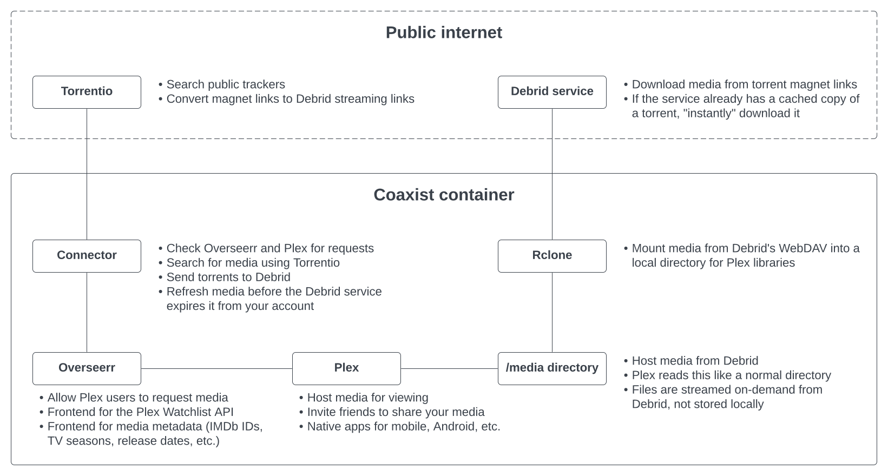

Coaxist is a self-hosted system that makes it easy to start watching your
favorite movies and TV shows on demand. Add content to your Plex watchlist and
it will appear in your library in minutes.

# Get Started

```sh
docker run \
	--cap-add SYS_ADMIN \
	--device /dev/fuse:/dev/fuse \
	--security-opt apparmor:unconfined \
	--mount type=bind,source="/home/myuser/coaxist/config,target=/config \
	--mount type=bind,source="/home/myuser/coaxist/transcode,target=/transcode \
	-p 32400:32400 \
	-p 5055:5055 \
	--name "coaxist" \
	-it "$APP_TAG" \
	"$@"
```

More info in the [Quick Start](docs/quick-start.md) guide.

# Tech Stack



Coaxist is a **single Docker container** containing:

- [**Plex**](https://plex.tv): Excellent server for self-hosting media. Plex has
  high-quality native apps for TV boxes, mobile devices, and desktop.
- [**Overseerr**](https://overseerr.dev): Request management software for Plex
  which doubles as an excellent server for media metadata.
- [**Rclone**](https://rclone.org/): Mounts WebDAV directories locally so that
  Plex can stream media files without copying them to local storage.
- [**Connector**](connector/README.md): Watches for media requests from
  Overseerr, searches for media sources using Torrentio, and sends selected
  torrents to a Debrid service for download.

Coaxist uses the following public cloud services:

- [**Torrentio**](https://torrentio.strem.fun/configure): Searches for media
  sources on torrent sites and converts magnet links to Debrid request links.
- **Debrid**: A paid service which downloads torrents and serves their contents.

## Supported Debrid services

- [AllDebrid](https://alldebrid.com)
- [Real-Debrid](https://real-debrid.com)
- ~~[Debrid-Link](https://debrid-link.fr)~~ WIP
- ~~[Offcloud](https://offcloud.com)~~ WIP
- ~~[Premiumize](https://www.premiumize.me)~~ WIP
- ~~[Put.io](https://put.io)~~ WIP

## What is a Debrid service?

A Debrid service is a paid commercial service that works in a way similar to a
hosted seedbox. This service takes a torrent file, magnet link, or link to a
file hosting service such as Mediafire. It downloads the content to its own
servers, then makes the content available to the subscriber. Users can stream
files individually over HTTP or mount everything locally via WebDAV.

"Instant downloads" are a useful feature of many Debrid services. Since the
service downloads files for many users at once, it has a large pool of content
on the servers at all times. If you request a link that the Debrid service has
already downloaded, and it still has a copy of those files, it will make that
copy available to you, "instantly downloading" it into your files.

# TODO

- [x] Run tests in GitHub Actions
- [x] Deploy to Docker Hub on release tag
- [x] Remove Next cache from Overseerr bit of image:
      `RUN rm -rf src server .next/cache`
- [x] Configure Overseerr to only run with prod deps:
      `RUN yarn install --production --ignore-scripts --prefer-offline`
- [x] Auto-template config files from superconfig
  - [x] Support Debrid services via simpler config (no WebDAV URL)
  - [x] Read Overseerr API key and copy into Connector
- [ ] Finish usage readme
- [ ] Separate out Quick Start Guide
- [x] Passthru env vars
- [ ] Media profile docs

# Quick Start Guide

- Run the container, mounting /config
- Sign into Plex at [localhost:32400/web](http://localhost:32400/web)
- Sign into Overseerr at [localhost:5055](http://localhost:5055)
- Copy your Overseerr API key into `/config/connector/config.yaml`
- Configure your Debrid API key in `/config/connector/config.yaml`
- Configure your desired media profiles in `/config/connector/profiles.yaml`
- Configure your Debrid WebDAV credentials in `/config/rclone/rclone.conf`

# Configuration

This container stores all of its data in the `/config` directory. Mount
`/config` inside the contianer to a real directory on your system with
read-write permissions.

After starting the container, configure the applications:

## [Rclone](https://rclone.org/)

Rclone mounts your Debrid provider's WebDAV storage as a local directory, so
that Plex can index and play its files.

Set your Debrid provider's WebDAV credentials in `/config/rclone/rclone.conf`:

```ini
url = https://webdav.example.com/
user = some-username
pass = some-obscured-password
```

To obscure your WebDAV password so that Rclone can use it, run
`rclone obscure my-password` and copy the obscured value into `rclone.conf`.

Find your WebDAV URL and credentials here:

- Real-Debrid:
  - `url = https://dav.real-debrid.com/`
  - `user`, `pass` from [My Account](https://real-debrid.com/account)
- AllDebrid:
  - `url = https://webdav.debrid.it/`
  - `user = ` an API key from [API Keys](https://alldebrid.com/apikeys/)
  - `pass = ` any value
- For other Debrid providers, follow the instructions to connect to WebDAV in
  their documentation.

If you need to further configure Rclone or the WebDAV settings, you can
customize the startup command in `/config/rclone/start.sh`.
