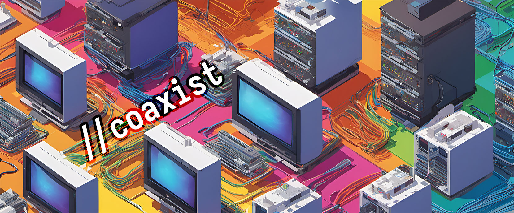

Coaxist is a self-hosted system that makes it easy to start watching your
favorite movies and TV shows on demand. Add content to your Plex watchlist and
it will appear in your library in minutes.

# Get Started

```sh
docker run \
  --device /dev/fuse:/dev/fuse \
	--cap-add SYS_ADMIN \
	--mount type=bind,source="/home/myuser/coaxist/config,target=/config" \
	--mount type=bind,source="/home/myuser/coaxist/transcode,target=/transcode" \
	-p 5055:5055 \
	-p 32400:32400 \
	--name "coaxist" \
	--restart always \
	--detach mplewis/coaxist:latest
```

For detailed instructions, see the [Quick Start](docs/quick-start.md) guide.

# Tech Stack


Coaxist is a **single Docker container** containing:

- [**Plex**](https://plex.tv): Excellent server for self-hosting media. Plex has
  high-quality native apps for TV boxes, mobile devices, and desktop.
- [**Overseerr**](https://overseerr.dev): Request management software for Plex
  which doubles as an excellent server for media metadata.
- [**Rclone**](https://rclone.org/): Mounts WebDAV directories locally so that
  Plex can stream media files without copying them to local storage.
- [**Connector**](connector/README.md): Watches for media requests from
  Overseerr, searches for media sources using Torrentio, and sends selected
  torrents to a Debrid service for download.

Coaxist uses the following public cloud services:

- [**Torrentio**](https://torrentio.strem.fun/configure): Searches for media
  sources on torrent sites and converts magnet links to Debrid request links.
- **Debrid**: A paid service which downloads torrents and serves their contents.

## What is a Debrid service?

A Debrid service is a paid commercial subscription service that works in a way
similar to a hosted seedbox. This service takes a torrent file, magnet link, or
link to a file hosting service such as Mediafire. It downloads the content to
its own servers, then makes the content available to the subscriber. Many
providers support "instant" downloads, where content you request is immediately
copied into your storage if another subscriber has requested it in the past.
